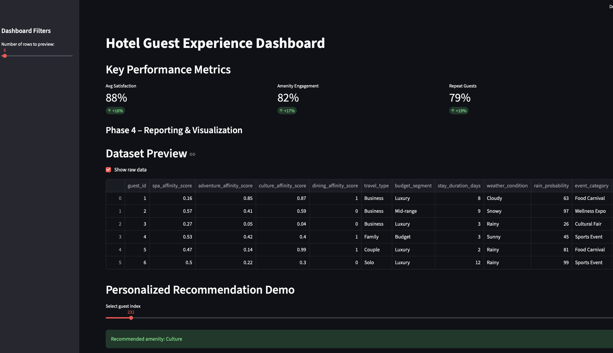
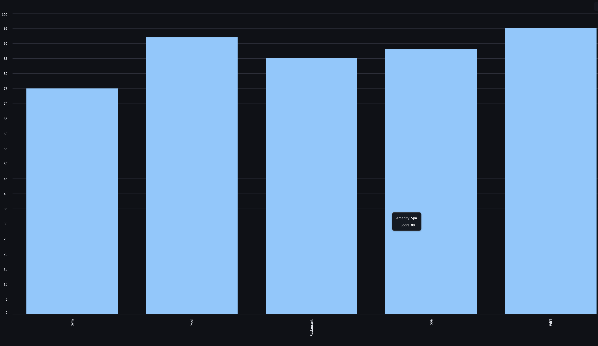
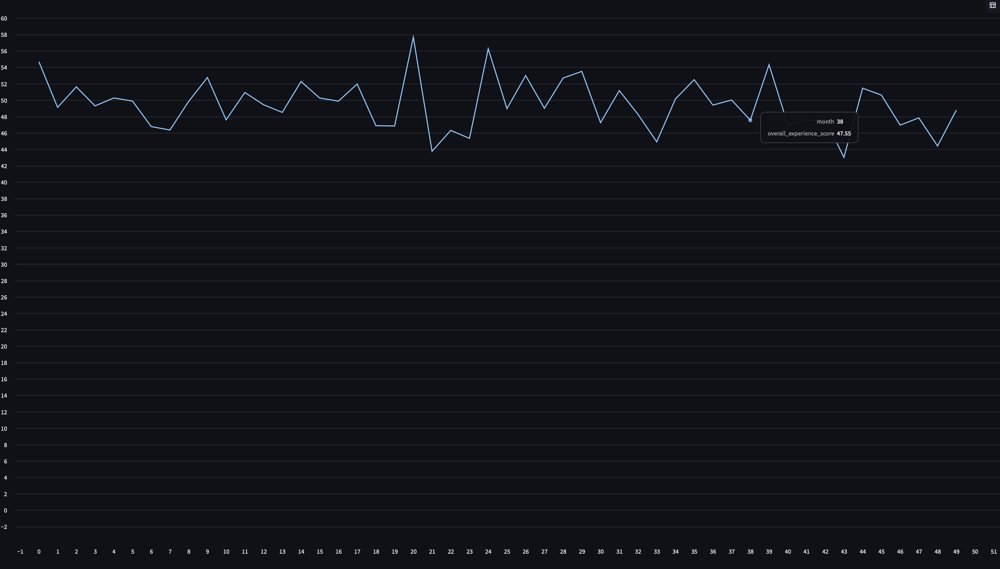

# Hotel Guest Personalization Dashboard

## Overview
AI-powered dashboard that recommends personalized hotel amenities
based on guest behavior and preferences.

## Features
- Interactive Streamlit dashboard
- Personalized recommendation engine
- Data visualization & analytics
- Guest experience heatmaps
- AI vs baseline comparison

## Tech Stack
Python, Streamlit, Pandas, NumPy, Matplotlib

## How to run
streamlit run dashboard.py

---

## 📊 Dashboard Preview

## Dashboard Preview

### Main Dashboard

### Guest Experience Heatmap

### Recommendation Demo

### Tourism Timeline

---

## 📁 Project Structure

hotel_recommendation_dataset/
│
├── dashboard.py
├── personalization.py
├── hotel_recommendation.ipynb
├── best_model.pkl
├── final_dataset_clean.csv
├── requirements.txt
├── screenshots/
└── README.md

---
